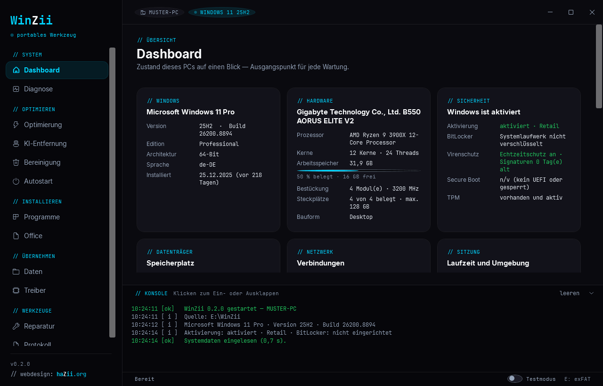

<div align="center">


# WinZii

**Portable Windows toolkit for everyday technician work.**
Run it from a USB stick: clean up, optimize, set up — no installation, no account, no telemetry.

[Deutsch](README.md) · **English**

<sub>**Fully bilingual, German and English** — interface, dialogs, log, reports and handover sheet. The language button sits at the bottom of the sidebar and takes effect immediately, including for values that were already measured.</sub>


[](https://github.com/haZiinstinct/WinZii/actions/workflows/pruefung.yml)


[Getting started](#-getting-started) · [Features](#-features) · [Safety](#-safety) · [Known limits](#-known-limits) · [Layout](#-layout) · [Extending](#-extending)

</div>

---

## ✨ Features

| Area | What it does |
| --- | --- |
| **Dashboard** | Windows version, hardware, GPU, monitors, BIOS, RAM slots and battery wear, plus activation, BitLocker, antivirus, disks and network — everything at a glance when taking on a PC. |
| **Diagnostics** | Reads the event logs and translates them into plain language: what happened, what it means, what to do. Plus bluescreen stop codes, disk health, and the sfc, DISM and chkdsk tools. |
| **Updates** | Shows what Windows still has to catch up on, and installs it. Drivers are listed separately and never preselected — Windows Update likes to offer older manufacturer builds there that overwrite a newer driver. Updates are installed one at a time so the log shows where it sticks; the PC is never restarted on its own. |
| **Optimization** | 41 tweaks for speed, telemetry, privacy and security. Each one explained, each one individually reversible. |
| **AI removal** | Finds Copilot, Recall and Click to Do — blocks them by policy or removes them entirely. The blocks also act preventively against feature updates. |
| **Cleanup** | First shows where the space went (caches, update leftovers, browser caches, Windows.old), then deletes selectively. Personal files are excluded. |
| **Programs** | 59 programs via winget, including a **security** section (second opinion, cleanup after an infection, protection afterwards), including bootstrapping winget itself on LTSC systems. Installers can be cached on the stick for offline use. |
| **Uninstall** | Finds and uninstalls installed programs — silently where possible — and then hunts down what the uninstaller left behind: the install folder, Start menu entries, the program's own registry keys. Findings are listed with their size, nothing is removed without confirmation, and keys are exported to `.reg` first. |
| **Office** | Microsoft 365, Office LTSC 2024 and 2021 via the official Deployment Tool — fully offline from the stick if you want. Plus LibreOffice. |
| **Data** | Answers the question before every reinstall: what needs backing up? Profile sizes per account, when an account was last used, Outlook data files, browser profiles, printers, network drives, product keys. Does more than warn about OneDrive placeholders that look like files in Explorer but are empty — it can download them and wait for completion. Exports bookmarks, Wi-Fi credentials, the device list and BitLocker keys, and copies the personal folders to an external drive with robocopy, never deleting anything at the source. |
| **Restore** | The other half of the data migration: re-create Wi-Fi networks, bookmarks, printers and network drives from a backup — including one taken on a different machine. Shows up front what fits and what does not: missing printer drivers, browser profiles that do not exist here, and Wi-Fi networks that were saved without their key. |
| **Drivers** | Devices with error codes in plain language instead of numbers. Driver inventory sorted by age — the fastest route to a suspect after bluescreens. Back up drivers to the stick and restore them in one go after reinstalling. |
| **Autostart** | Shows everything that starts at sign-in, with publisher. Disable instead of delete — reversible at any time. |
| **Repair** | Measures first where the problem sits (adapter, IP, router, DNS, internet), then names the matching fix. Plus Windows Update cache reset, print queue flush, quick virus scan, preinstalled app removal. |
| **Protocol** | Every step is recorded. Two outputs: the technical log and the **handover sheet** — what was done, how much space was gained, how the PC is equipped and what remains, in customer language with fields for technician, customer and order number. |

---

## 🚀 Getting started

1. Download the latest ZIP from the [releases](https://github.com/haZiinstinct/WinZii/releases) and extract it onto a USB stick (**exFAT or NTFS**, not FAT32 — the Office payloads would not fit).
2. Double-click `Start.bat`.
3. Confirm the administrator prompt.

That is all. WinZii needs no installation, no runtime, no particular drive letter. The folder can have any name and live anywhere — including paths with spaces.

> **Windows shows a blue SmartScreen warning?**
> Click "More info" and then "Run anyway". The warning appears for any unsigned file downloaded from the internet. Every release ships a SHA256 checksum so you can verify the archive before extracting:
> ```powershell
> Get-FileHash .\WinZii-0.5.2.zip -Algorithm SHA256
> ```

**Requirements:** Windows 10 or 11 with administrator rights. PowerShell 5.1 and .NET Framework ship with Windows.

**First run: use test mode.** The toggle in the bottom right logs every change without executing it. `Start.bat` passes switches through — `Start.bat -DryRun` starts straight into test mode, `Start.bat -NoElevate` skips the elevation prompt.

---

## 🛡 Safety

A tool that reaches deep into the system must know the way back:

- **Restore point** before every larger intervention (optional, on by default).
- **Registry export** of every touched key as a `.reg` file.
- **Undo file** with the exact prior state of every single action — the "revert changes" button restores it.
- **Test mode** that only logs.
- **Confirmation before every intervention**, listing exactly what will happen.

Everything lands under `backups\<hostname>\<timestamp>\`.

What does **not** happen: no telemetry, no outbound connections except downloads you explicitly trigger (winget, Office, LibreOffice), no deletion of personal files. The Downloads folder is only measured, never emptied.

Two exports intentionally write secrets in plain text to the stick, each behind its own confirmation: the **Wi-Fi export with keys** and the **BitLocker recovery keys**. Do not hand the stick to strangers afterwards. Details in [SECURITY.md](SECURITY.md) (German).

> **No warranty.** WinZii modifies Windows at a low level. Use at your own risk — review in test mode first, let it create a restore point before larger interventions, and back up customer data beforehand.

---

## ⚠ Known limits

To be blunt, so nobody gets surprised: WinZii was developed on **one** machine — Windows 11 Enterprise, German locale, a desktop without battery, Wi-Fi, BitLocker or OneDrive. Since 0.4.1 a second device joins in: a notebook with a battery and Wi-Fi, where the acceptance run from [docs/ABNAHME.md](docs/ABNAHME.md) takes place. Whatever has been checked there is listed below as checked.

| Area | Status |
| --- | --- |
| **Windows 10** | The version switch works (33 tweaks for both systems, 7 Windows-11-only, 1 Windows-10-only), but a full run never happened there. |
| **Non-German Windows** | Since 0.5.2 every check tool runs on an **English** Windows server on each push, and the interface is started there in both languages. What remains untested is what real Windows tools return: `sfc`, `DISM`, `chkdsk` and `manage-bde` answer in English there, and WinZii parses that. Point 13 of the acceptance list covers it. |
| **Battery** | Verified on the notebook: wear is measured and shown on the dashboard. Up to 0.4.0 that same device reported "no battery present", because detection hung on a single WMI class. |
| **Wi-Fi** | Connection check, internet access and, since 0.5.1, downloads verified over Wi-Fi with no cable in the machine: 93 MB in 32 s, an install through winget including the follow-up check, and a failed download leaves nothing half-finished behind. |
| **BitLocker, OneDrive** | The "not present" path is verified and reports cleanly, on the notebook additionally cross-checked against `manage-bde`. An encrypted volume and a OneDrive with placeholders are still missing. |
| **Power plan** | Creating, activating, a second run without a duplicate copy, and undoing have been exercised on the notebook. What separates mains from battery are the cooling policy and the turbo behaviour — many vendors hide both from the power UI. They can still be set, you just cannot inspect them there afterwards. If a device cannot set them at all, WinZii says in the log that the plan achieves nothing. |
| **Downloading Office** | Cancelling ends the deployment tool, **not** the download: the fetching is done by the Windows Click-to-Run service, which carries on in the background. During the acceptance run the folder grew from 39 MB to 2.5 GB after the cancel. WinZii says so in the log and names the folder to delete; since 0.4.1 a partial cache is reliably reported as incomplete. |
| **Leftover cleanup after uninstalling** | The rules and the whole chain — find, back up, remove — are covered by 46 checks in `tools\Test-Undo.ps1`. Since 0.5.1 it has also faced real uninstallers, on a machine with 53 programs grown over the years; that run found two bugs, both fixed (see the [CHANGELOG](CHANGELOG.md)). Two things hold permanently: **deleted folders are gone for good** — only registry keys are backed up — and the search is deliberately narrow. It would rather miss a leftover than touch another program's folder — since 0.5.1 not even when the vendor itself records the whole family's shared folder as the install location. |
| **Driver backup, Office install** | Verified read-only, never executed end to end. |
| **Restoring printers** | Fully exercised in the Sandbox: pulling the driver from the driver store, creating the network port, adding the printer, and not duplicating it on a second run. What remains untested is a printer on real hardware — USB ports only appear once the device is attached and are deliberately skipped. |
| **Restoring Wi-Fi** | Profile files are read correctly and a failure is reported cleanly. Actually creating a profile could never be verified — neither the development machine nor the Sandbox has a Wi-Fi adapter. |
| **Small screens** | The window needs at least 1000 × 560 device-independent pixels and shrinks itself to the working area. At 1092 × 614 — a 1366-wide laptop at 125 % — everything checks out: the console starts collapsed, the sidebar scrolls the active entry into view, nothing sits outside the window. Since 0.5.0 no word breaks mid-card even at the exact minimum. |

**Verified in Windows Sandbox** (`tools\Test-Sandbox.wsb`, a pristine Windows 11 24H2 without winget): launcher startup, applying real tweaks and reverting them, network diagnosis, the winget bootstrap, finding and reading a backup, adding a network printer including its driver, and a real file migration with subfolders — all on a system that knows nothing about this project.

Feedback from other systems is very welcome — especially from Windows 10 and non-German installations.

---

## 🖼️ Interface

Dark theme in the haZii style, German or English, with a live console: every action is visible while it runs. Long operations never block the UI.



Twelve pages in five groups:

```
// SYSTEM        Dashboard · Diagnostics
// OPTIMIZE      Optimization · AI removal · Cleanup · Autostart
// INSTALL       Programs · Office
// TAKE OVER     Data · Drivers
// TOOLS         Repair · Protocol
```

---

## 🛠 Layout

```
WinZii/
├─ Start.bat              double-click entry point
├─ src/
│  ├─ launcher.ps1        elevation, unblocking, STA start
│  ├─ main.ps1            window, navigation and module setup
│  ├─ modules/            logic (Optimizer, Cleanup, Apps, Office, Diagnostics …)
│  ├─ pages/              per-page UI logic
│  ├─ xaml/               UI: Theme.xaml + one file per page
│  └─ templates/          template for the HTML reports
├─ data/                  catalogs as JSON — extend the tool here
├─ assets/fonts/          JetBrains Mono and Inter (SIL OFL 1.1, see below)
├─ tools/                 dev checks and the release build script
├─ docs/                  banner and screenshot for the readme
├─ offline/               cache for installers
├─ logs/ backups/ reports/  per-computer results
```

**Tech:** PowerShell 5.1 with WPF. No compilation, no dependencies — the code is readable and directly editable. Long operations run in their own runspaces so the UI stays responsive.

---

## 🔧 Extending

All content lives in `data/` as JSON. New entries need zero lines of code — the file formats are documented in the German readme, the fields are self-explanatory. Validate after every change:

```powershell
powershell -NoProfile -ExecutionPolicy Bypass -File tools\Test-Catalogs.ps1
```

Contribution guidelines (including the **UTF-8 BOM requirement** for all `.ps1`/`.xaml` files — PowerShell 5.1 reads files without a BOM as ANSI and destroys non-ASCII text) are in [CONTRIBUTING.md](CONTRIBUTING.md) (German). Version history: [CHANGELOG.md](CHANGELOG.md) (German).

---

## 📄 License

**WinZii** is MIT-licensed — see [LICENSE](LICENSE).

**The bundled fonts are not.** [Inter](https://github.com/rsms/inter) and [JetBrains Mono](https://github.com/JetBrains/JetBrainsMono) under `assets/fonts/` are licensed under the **SIL Open Font License 1.1**; the license texts sit next to them as `OFL-Inter.txt` and `OFL-JetBrainsMono.txt`.

The AI-removal techniques draw on [zoicware/RemoveWindowsAI](https://github.com/zoicware/RemoveWindowsAI); the portable-toolkit approach on [Chris Titus WinUtil](https://github.com/christitustech/winutil).

---

<div align="center">

Built by haZii · `// code:` [**haZii.org**](https://hazii.org)

</div>
